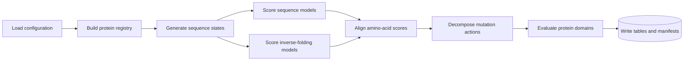

# MARGIN

_Modality Attribution of Residual Gain in Inverse-Folding Networks_

MARGIN is a Python toolkit for measuring how sequence and structure-conditioned protein models
contribute to mutation ranking. It aligns heterogeneous model outputs in a common 20-amino-acid
score space, decomposes mutation actions into interpretable components, and reports protein-level
metrics with clustered uncertainty estimates.

The repository includes a CPU-friendly synthetic workflow, reusable Python modules, model adapter
entry points, strict YAML configuration, and focused workflows for stability, counterfactual,
generalization, and structure-sensitivity analyses.

---

[Installation](#installation) · [Quick start](#quick-start) · [Core method](#core-method) ·
[Architecture](#architecture) · [Workflows](#workflows) ·
[Configuration and data](#configuration-and-data) · [Python API](#python-api) ·
[Development](#development)

## Overview

MARGIN supports a complete path from model scores to domain-level comparisons:

| Capability | Result |
| --- | --- |
| Score canonicalization | Aligned natural-log probabilities over `ACDEFGHIKLMNPQRSTVWY` |
| Mutation actions | Wild-type-anchored scores for every residue substitution |
| Sequence-relative residuals | Centered log-ratio coordinates for model differences |
| Action decomposition | Global substitution, sequence-context, and retained components |
| Protein-level evaluation | Spearman, normalized discounted cumulative gain (NDCG), top-`k` recall, and component margins |
| Uncertainty estimation | Equal-domain summaries and domain-cluster bootstrap intervals |
| Reproducible execution | Resolved configuration, manifests, seeded analyses, and typed tables |

Typical inputs include protein sequences, wild-type backbones, model score tables, frozen sequence
representations, and variant-effect measurements. Typical outputs include Parquet tables, NumPy
arrays, JSON manifests, CSV summaries, and workflow-specific reports.

The codebase uses _teacher_ for a structure-conditioned score provider. Teacher adapters emit the
same tabular contract, which lets evaluation code operate independently of each upstream model.

## Installation

MARGIN requires Python 3.10 or newer.

### Standard installation

```bash
git clone https://github.com/GeraltZeroZhong/MARGIN.git
cd MARGIN
python -m venv .venv
source .venv/bin/activate
python -m pip install --upgrade pip
python -m pip install -e .
```

### Development and model dependencies

Install test, lint, and build tools:

```bash
python -m pip install -e ".[dev]"
```

Install the integrations used for representation export, supervised references, and Transformer
model adapters:

```bash
python -m pip install -e ".[models]"
```

Selected real-data workflows also use MMseqs2 for homology search and DSSP for secondary-structure
assignment. Their executable paths live in the corresponding YAML configuration.

## Quick start

The synthetic configuration ships with deterministic fixtures and runs on CPU. It exercises
registry construction, state generation, teacher scoring, residual attribution, domain-level
evaluation, and artifact writing.

```bash
margin validate-config --config configs/synthetic.yaml
margin doctor --config configs/synthetic.yaml
margin run --config configs/synthetic.yaml --device cpu
```

The commands provide three checkpoints:

1. `validate-config` parses the YAML file and prints the resolved configuration
2. `doctor` checks the files, executables, environments, and adapters declared by that configuration
3. `run` executes the foundation workflow and prints the result, report path, and manifest path

Synthetic outputs are written below `runs/synthetic/`.

### Discover available workflows

```bash
margin list-workflows
margin describe-workflow stability
```

Every workflow script exposes `--help`:

```bash
python scripts/workflows/observability/prepare_replication.py --help
python scripts/workflows/stability/evaluate.py --help
python scripts/workflows/stability/audit_position_specificity.py --help
```

### Start from a real-data configuration

Copy the closest example, update its paths and model specifications, then run the same validation
sequence:

```bash
cp configs/foundation.yaml experiment.yaml
margin validate-config --config experiment.yaml
margin doctor --config experiment.yaml
```

The diagnostic table names each missing dependency and shows the resolved path or environment
identifier used by the workflow.

## Core method

### Canonical score space

For residue position $i$, amino acid $a$, and model $t$, MARGIN represents model output as
a normalized natural-log probability:

$$
L_t(i,a) = \log p_t(a \mid x_i),
\qquad
\operatorname{logsumexp}_{a} L_t(i,a) = 0.
$$

All arrays follow the fixed amino-acid order `ACDEFGHIKLMNPQRSTVWY`. An adapter can begin with
logits, log probabilities, or candidate scores; canonicalization produces the shared representation
used by downstream stages.

### Wild-type-anchored mutation actions

For wild-type residue $w_i$, the mutation action is

$$
A_t(i,a) = L_t(i,a) - L_t(i,w_i).
$$

This anchoring sets the wild-type entry to zero and expresses every candidate substitution on the
same within-position scale.

### Sequence-relative residuals

Let $L_{\mathrm{seq}}$ be the sequence-model baseline. MARGIN first computes the log-probability
difference

$$
D_t(i,a) = L_t(i,a) - L_{\mathrm{seq}}(i,a),
$$

then centers it across the 20 amino acids:

$$
R_t(i,a) =
D_t(i,a) - \frac{1}{20}\sum_b D_t(i,b).
$$

The centered vector is the log-ratio coordinate used for residual reconstruction, observability,
teacher agreement, and counterfactual comparisons.

### Action components

The action-validation workflow represents a teacher action as

$$
A_t = G_t + C_t + U_t.
$$

- $G_t$ captures global substitution preferences conditional on wild-type identity
- $C_t$ captures the component predicted from frozen sequence representations and local context
- $U_t$ is the retained position-level action after subtracting $G_t$ and $C_t$

Reduced-rank ridge models estimate $C_t$ on configured training splits. Evaluation then measures
the incremental ranking value of each component at the protein or domain level.

### Evaluation

The evaluation layer provides:

- native negative log-likelihood, recovery, and teacher-agreement summaries
- per-domain Spearman correlation, NDCG, and stabilizing top-`k` recall
- equal-domain aggregation and stratified domain bootstrap intervals
- shuffled-target and within-domain position-permutation analyses
- matched structure, counterfactual, strong sequence, and cross-platform comparisons
- matched-backbone and coordinate-sensitivity analyses

## Architecture

MARGIN separates reusable algorithms from executable orchestration. Configuration and registries
define the analysis population, adapters produce canonical score tables, and study modules generate
metrics and manifests.



### Repository layout

| Path | Responsibility |
| --- | --- |
| `src/margin/` | Reusable schemas, algorithms, statistics, and workflow implementations |
| `src/margin/studies/` | Analysis modules grouped by scientific question |
| `scripts/models/` | Isolated model runners and representation exporters |
| `scripts/workflows/` | Executable orchestration for each analysis |
| `configs/` | Portable, validated workflow configurations |
| `tests/` | Deterministic unit and integration coverage |

### Core packages

| Package | Responsibility |
| --- | --- |
| `margin.config` | Strict configuration models and path resolution |
| `margin.data_registry` | Domain, residue, benchmark, and homology schemas |
| `margin.preprocessing` | Coordinate parsing and residue-level structural features |
| `margin.state_sampling` | Sequence-state generation and policy diagnostics |
| `margin.teachers` | Request construction, score canonicalization, and adapter execution |
| `margin.attribution` | Residual metrics, observability, component value, and grouped inference |
| `margin.studies` | End-to-end analysis implementations |
| `margin.provenance` | Runtime manifests and artifact metadata |

## Workflows

The workflow registry connects a stable name to its Python package, default configuration, and
script directory.

| Workflow | Analysis scope | Default configuration |
| --- | --- | --- |
| `foundation` | Registry, state bank, teacher value, observability, and policy evaluation | `configs/foundation.yaml` |
| `observability` | Residual learnability from frozen sequence representations | `configs/observability.yaml` |
| `generalization` | Architecture, lineage, environment, and deep mutational scanning transfer | `configs/generalization.yaml` |
| `counterfactuals` | Structure-residual response under matched counterfactuals | `configs/counterfactuals.yaml` |
| `mechanisms` | In-distribution perturbation and denoising analyses | `configs/mechanisms.yaml` |
| `action_validation` | $G/C/U$ action decomposition and component evaluation | `configs/action_validation.yaml` |
| `stability` | Calibration, consensus scoring, sequence baselines, and position specificity | `configs/stability.yaml` |
| `external_validation` | Cross-platform evaluation with fixed score components | `configs/external_validation.yaml` |
| `structure_sensitivity` | Matched experimental and predicted-backbone analysis | `configs/structure_sensitivity.yaml` |

Programmatic discovery uses `margin.workflows.WORKFLOWS` and
`margin.workflows.get_workflow()`.

## Configuration and data

### Configuration model

YAML files load through strict Pydantic models. Unknown keys, invalid ranges, malformed model
specifications, and inconsistent modes raise errors during configuration loading. Relative paths
resolve from `paths.project_root`.

Common configuration groups include:

| Group | Controls |
| --- | --- |
| `paths` | Inputs, caches, run directory, and project root |
| `registry` | Sequence, structure, topology, and annotation filters |
| `state_bank` | Sequence perturbations, sampling ratios, and rollout settings |
| `teacher_cache` | Model adapters, revisions, score types, batching, and storage |
| `observability` | Grouped splits, probe models, and reconstruction metrics |
| `inference` or `audit` | Bootstrap units, confidence level, and summary settings |
| `plot` | Dimensions, formats, and rendering resolution |

### Data contracts

MARGIN exchanges typed tables between stages. Parquet is the primary tabular format; NumPy archives
store dense representations and action matrices.

| Contract | Scientific key | Core fields |
| --- | --- | --- |
| Domain registry | `domain_id` | Sequence, structure path, CATH labels, source, analysis role |
| Residue registry | `domain_id`, `position` | Residue identity, backbone coordinates, DSSP annotations, solvent accessibility, contacts, conservation |
| State bank | `state_id`, `domain_id` | Reference and perturbed sequences, perturbation metadata, policy diagnostics |
| Teacher scores | State, domain, position, teacher | `logp_A` through `logp_Y`, revision, conditioning, timing |
| Residual dataset | State, domain, position | Sequence log probabilities, teacher log probabilities, centered residuals |
| Variant components | Domain, position, mutant | Sequence action, $G$, $C$, $U$, consensus, observed effect |
| Domain metrics | Domain, method | Spearman, NDCG, top-`k` recall, component margins |

Positions are zero-based and contiguous within each domain. Canonical score rows cover the fixed
20-residue alphabet and preserve model revision, conditioning mode, and runtime metadata.

### Outputs and provenance

Each workflow writes results beneath its configured `run_dir`. Manifests record the resolved
configuration, schema version, random seed, upstream paths, table shapes, and runtime metadata.
Generated data, run directories, model resources, and caches are excluded from version control by
the repository ignore rules.

## Python API

### Load a configuration

```python
from pathlib import Path

from margin.config import load_config

config = load_config(Path("configs/synthetic.yaml"))
print(config.project_name)
print(config.paths.run_dir)
```

### Discover workflows

```python
from margin.workflows import WORKFLOWS, get_workflow

for workflow in WORKFLOWS:
    print(workflow.name, workflow.config)

stability = get_workflow("stability")
print(stability.package)
print(stability.scripts)
```

### Run the synthetic foundation workflow

```python
from pathlib import Path

from margin.pipeline import run_foundation_audit

result = run_foundation_audit(Path("configs/synthetic.yaml"), device="cpu")
print(result.decision.decision)
print(result.run_manifest_path)
```

### Model adapter contract

MARGIN includes runners for MIF-ST, ProteinMPNN, and ESM-IF1, together with representation
exporters for CARP and ESM-family sequence models. External teacher specifications declare:

- `adapter`, `model_name`, and `model_revision`
- `conda_env` for isolated execution
- `repository`, `repository_revision`, and model weights
- `score_type`, `batch_size`, and inference repetitions

The adapter launcher invokes the selected runner, records runtime metadata, validates row coverage,
and converts returned scores to the canonical teacher-score schema.

## Development

Install the development dependencies and run the repository checks:

```bash
python -m pip install -e ".[dev]"
ruff check src scripts tests
PYTHONPATH=src python -m pytest
python -m build
```

The tests cover configuration, registries, sequence states, teacher contracts, residual metrics,
action decomposition, workflow discovery, external scoring, and the synthetic end-to-end path.

### Add a model adapter

1. Add a runner under `scripts/models/` that emits one row per requested position
2. Register the runner in `margin.teachers.external.RUNNERS`
3. Convert raw scores through the canonical teacher-score schema
4. Add coverage, normalization, cache-reuse, and row-order tests

### Add an analysis workflow

1. Place reusable algorithms under `src/margin/studies/<workflow>/`
2. Place executable orchestration under `scripts/workflows/<workflow>/`
3. Add a strict configuration model and a portable example configuration
4. Register the workflow in `margin.workflows.WORKFLOWS`
5. Add deterministic unit tests and a synthetic integration path

### License

MARGIN is distributed under the [MIT License](LICENSE).

## Troubleshooting

### `ModuleNotFoundError: margin`

Install the repository in editable mode:

```bash
python -m pip install -e ".[dev]"
```

For a direct source-tree invocation, set `PYTHONPATH=src`.

### A teacher environment check fails

List available Conda environments, then update `teacher_cache.teachers[].conda_env` in the selected
configuration:

```bash
conda env list
margin doctor --config experiment.yaml
```

### MMseqs2 or DSSP is unavailable

Set `homology.executable` and `registry.dssp_executable` to executable names available on
`PATH`, or provide absolute executable paths in the experiment configuration.

### GPU memory is exhausted

Reduce the relevant `batch_size`, select a smaller representation model, or run the adapter on CPU
with `--device cpu`.

### A workflow cannot find an input

Run `margin validate-config` to inspect resolved paths, then run `margin doctor` to identify the
missing file, executable, environment, repository, or model weight.

### Getting help

Open a [GitHub issue](https://github.com/GeraltZeroZhong/MARGIN/issues) with the command, configuration
section, traceback, Python version, and operating-system details needed to reproduce the problem.
