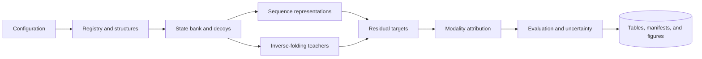

# MARGIN: Modality Attribution of Residual Gain in Inverse-Folding Networks

_A Python toolkit for attributing mutation-ranking gains across sequence and structure modalities._

---

MARGIN standardizes sequence-model and inverse-folding outputs into residue-level amino-acid
action matrices. It measures predictive gains relative to sequence controls, decomposes
structure-conditioned actions into interpretable components, and evaluates each component with
protein-level uncertainty estimates.

## Contents

- [Method](#method)
- [Workflow architecture](#workflow-architecture)
- [Installation](#installation)
- [Quick start](#quick-start)
- [Workflow catalog](#workflow-catalog)
- [Configuration](#configuration)
- [Data contracts](#data-contracts)
- [Python API](#python-api)
- [Model adapters](#model-adapters)
- [Development](#development)
- [Troubleshooting](#troubleshooting)

## Method

For residue position $i$, amino acid $a$, wild-type residue $w_i$, and model $t$, MARGIN first
normalizes model outputs into a canonical 20-amino-acid log-probability vector
$L_t(i, \cdot)$. Mutation actions are anchored at the wild type:

$$
A_t(i, a) = L_t(i, a) - L_t(i, w_i).
$$

Given a sequence baseline $L_{\mathrm{seq}}$, the structure-conditioned residual is represented
in centered log-ratio space:

$$
R_t(i, \cdot) = \operatorname{clr}\left(
L_t(i, \cdot) - L_{\mathrm{seq}}(i, \cdot)
\right).
$$

The action-attribution workflow decomposes each teacher action matrix as

$$
A_t = G_t + C_t + U_t,
$$

where $G_t$ captures wild-type-conditioned global substitution preferences, $C_t$ captures the
component predictable from sequence representations and local context, and $U_t$ is the remaining
teacher action. Reduced-rank regression estimates $C_t$; protein-level evaluation then quantifies
the incremental ranking value carried by $U_t$.

The evaluation layer includes:

- native negative log-likelihood, recovery, rank, and teacher-agreement metrics
- centered-log-ratio residual reconstruction and shuffled-target controls
- per-domain Spearman correlation, NDCG, and stabilizing top-$k$ recall
- stratified domain bootstrap confidence intervals
- matched decoy, counterfactual structure, calibration, and strong sequence controls
- cross-platform and matched-backbone sensitivity analyses

## Workflow architecture



The package separates reusable algorithms from executable workflows. Modules under
`src/margin/` implement schemas, preprocessing, model-score normalization, statistical analysis,
and evaluation. Entry points under `scripts/workflows/` compose those modules into complete
analyses.

| Package | Responsibility |
|---|---|
| `margin.config` | Strict configuration models and path resolution |
| `margin.data_registry` | Domain, residue, benchmark, and homology schemas |
| `margin.preprocessing` | Coordinate parsing and residue-level structural features |
| `margin.state_sampling` | Sequence-state generation and policy diagnostics |
| `margin.teachers` | Request construction, score canonicalization, and adapter execution |
| `margin.attribution` | Residual metrics, observability probes, teacher value, and grouped inference |
| `margin.studies` | End-to-end analysis implementations grouped by scientific responsibility |
| `margin.provenance` | Deterministic manifests and artifact metadata |

## Installation

MARGIN requires Python 3.10 or newer.

```bash
python -m venv .venv
source .venv/bin/activate
python -m pip install --upgrade pip
python -m pip install -e ".[dev]"
```

Install the model dependencies for representation export, supervised controls, and Transformer
adapters:

```bash
python -m pip install -e ".[dev,models]"
```

Real-structure workflows can also use MMseqs2 for homology searches and DSSP for secondary
structure assignment. Their executable paths are configured in YAML.

## Quick start

The synthetic configuration exercises registry construction, state sampling, teacher-score
generation, attribution audits, plotting, and report generation with deterministic fixtures.

```bash
margin validate-config --config configs/synthetic.yaml
margin doctor --config configs/synthetic.yaml
margin run --config configs/synthetic.yaml --device cpu
```

The command prints the final decision, report path, and run manifest. Generated artifacts are
written below `runs/synthetic/`.

Inspect the available analyses:

```bash
margin list-workflows
margin describe-workflow stability
```

Each workflow directory contains focused entry points with standard `--help` output:

```bash
python scripts/workflows/observability/prepare_replication.py --help
python scripts/workflows/stability/evaluate.py --help
python scripts/workflows/stability/audit_position_specificity.py --help
```

## Workflow catalog

| Workflow | Primary responsibility | Package |
|---|---|---|
| `foundation` | Registry, state-bank, teacher-value, observability, and policy audits | `margin.pipeline` |
| `observability` | Residual learnability from sequence representations | `margin.studies.observability` |
| `generalization` | Architecture, lineage, environment, and DMS transfer | `margin.studies.generalization` |
| `counterfactuals` | Structure-residual behavior under matched counterfactuals | `margin.studies.counterfactuals` |
| `mechanisms` | In-distribution perturbation and denoising analyses | `margin.studies.mechanisms` |
| `action_validation` | $G/C/U$ action decomposition and component evaluation | `margin.studies.action_validation` |
| `stability` | Model calibration, consensus scoring, strong sequence controls, and position specificity | `margin.studies.stability` |
| `external_validation` | Cross-platform evaluation with fixed scoring components | `margin.studies.external_validation` |
| `structure_sensitivity` | Matched-backbone and coordinate-sensitivity analysis | `margin.studies.structure_sensitivity` |

The workflow registry is available programmatically through `margin.workflows.WORKFLOWS`.

## Configuration

Configuration files use strict Pydantic schemas. Unknown keys, invalid ranges, inconsistent modes,
and malformed model specifications raise validation errors during loading. Relative paths resolve
from `paths.project_root`.

The foundation configuration is organized into the following groups:

| Group | Controls |
|---|---|
| `paths` | Input locations and run destination |
| `registry` | Structure quality, sequence length, topology, and annotation rules |
| `state_bank` | Corruption families, sampling ratios, and policy parameters |
| `student_policy` | Sequence-policy adapter and checkpoint specification |
| `homology` | MMseqs2 executable, sensitivity, coverage, and E-value settings |
| `decoys` | Matched structures, permutations, and contact rewiring |
| `teacher_cache` | Teacher adapters, checkpoints, score normalization, and batching |
| `observability` | Grouped folds, probe controls, and reconstruction metrics |
| `on_policy` | State matching and rollout comparison parameters |
| `audit` | Bootstrap units, confidence level, and primary evaluation identifiers |
| `decision` | Decision thresholds for the foundation audit |
| `plot` | Figure dimensions, formats, and rendering resolution |

Create an experiment configuration from the closest example and validate it before execution:

```bash
cp configs/foundation.yaml experiment.yaml
margin validate-config --config experiment.yaml
margin doctor --config experiment.yaml
```

`margin doctor` checks configured files, executables, model repositories, repository revisions,
weights, policy factories, and Conda environments.

## Data contracts

MARGIN exchanges typed tables between stages. Parquet is the primary tabular format; NumPy arrays
store dense representations and action matrices.

| Contract | Scientific key | Core fields |
|---|---|---|
| Domain registry | `domain_id` | sequence, structure path, CATH labels, source, analysis role |
| Residue registry | `domain_id`, `position` | residue identity, backbone coordinates, DSSP, RSA, contacts, conservation |
| State bank | `state_id`, `domain_id` | reference and perturbed sequences, corruption metadata, policy diagnostics |
| Teacher scores | state, domain, position, teacher, structure role | `logp_A` through `logp_Y`, model revision, conditioning, timing |
| Residual dataset | state, domain, position | sequence log probabilities, teacher log probabilities, CLR residuals |
| Variant components | domain, position, mutant | sequence score, $G$, $C$, $U$, consensus, observed effect |
| Domain metrics | domain, method | Spearman, NDCG, top-$k$ recall, component margins |

Canonical teacher rows satisfy log normalization across the fixed alphabet
`ACDEFGHIKLMNPQRSTVWY`. Positions are zero-based and contiguous within each domain.

## Python API

Load and validate a configuration:

```python
from pathlib import Path

from margin.config import load_config

config = load_config(Path("configs/synthetic.yaml"))
print(config.project_name)
print(config.paths.run_dir)
```

Discover workflows:

```python
from margin.workflows import WORKFLOWS, get_workflow

for workflow in WORKFLOWS:
    print(workflow.name, workflow.config)

stability = get_workflow("stability")
print(stability.package)
```

Run the synthetic foundation audit:

```python
from pathlib import Path

from margin.pipeline import run_foundation_audit

result = run_foundation_audit(Path("configs/synthetic.yaml"), device="cpu")
print(result.decision.decision)
print(result.run_manifest_path)
```

## Model adapters

MARGIN includes adapters for MIF-ST, ProteinMPNN, and ESM-IF1, together with representation
exporters for CARP and ESM-family sequence models. Every adapter converts upstream model output to
the canonical teacher-score schema before evaluation.

External teacher specifications define:

- `adapter`, `model_name`, and `model_revision`
- `conda_env` for isolated execution
- `repository` and `repository_revision`
- `weights` and optional `auxiliary_weights`
- `score_type`, `batch_size`, and inference repetitions

Set `conda_env` to the environment that contains the corresponding upstream model implementation.
The adapter launcher executes the pinned runner with `conda run`, records runtime metadata, and
canonicalizes the returned scores.

## Development

Run the complete code-quality suite from the repository root:

```bash
ruff check src scripts tests
PYTHONPATH=src python -m pytest
python -m build
```

The tests cover schema validation, registry and state construction, teacher contracts, residual
metrics, action decomposition, workflow discovery, external scoring, and a synthetic end-to-end
run.

When adding a teacher adapter:

1. Implement a runner under `scripts/models/` that emits one row per request position.
2. Register the runner in `margin.teachers.external.RUNNERS`.
3. Convert raw scores through the canonical teacher-score schema.
4. Add coverage, normalization, cache-reuse, and ordering tests.

When adding an analysis workflow:

1. Place reusable algorithms under `src/margin/studies/<workflow>/`.
2. Place executable orchestration under `scripts/workflows/<workflow>/`.
3. Add a strict configuration model and a portable example configuration.
4. Register the workflow in `margin.workflows.WORKFLOWS`.
5. Add deterministic unit tests and a synthetic integration path.

## Troubleshooting

### `ModuleNotFoundError: margin`

Install the repository in editable mode:

```bash
python -m pip install -e ".[dev]"
```

For a direct source-tree invocation, set `PYTHONPATH=src`.

### Teacher environment check fails

List available Conda environments and update `teacher_cache.teachers[].conda_env` in the selected
configuration:

```bash
conda env list
margin doctor --config experiment.yaml
```

### MMseqs2 or DSSP check fails

Set `homology.executable` and `registry.dssp_executable` to executable names available on `PATH`, or
use absolute executable paths in the experiment configuration.

### GPU memory is exhausted

Reduce the relevant teacher or representation `batch_size`, select a smaller representation model,
or run the adapter on CPU with `--device cpu`.
